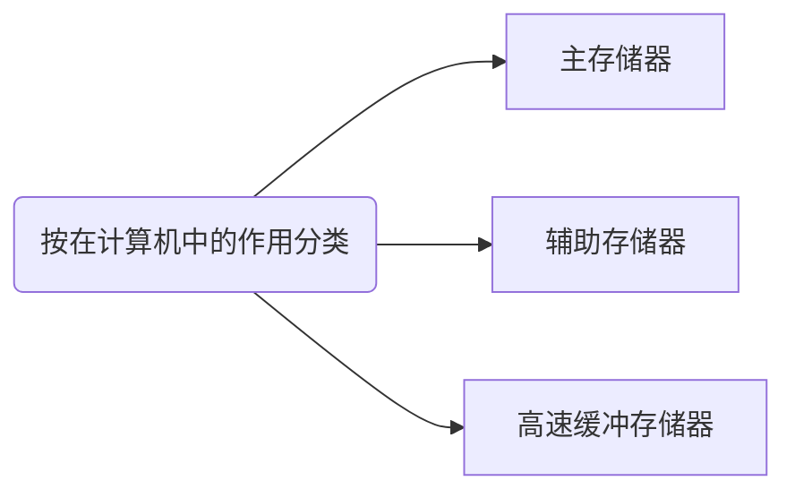
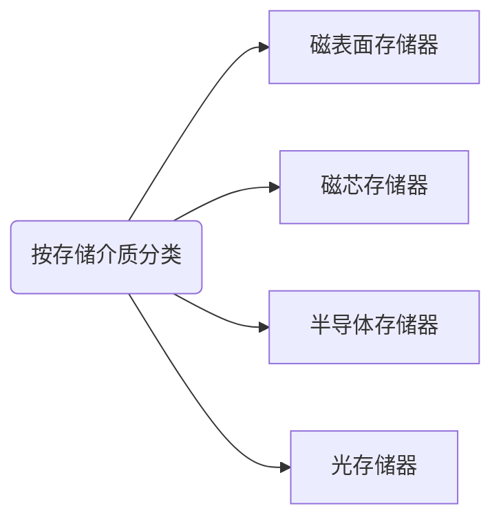
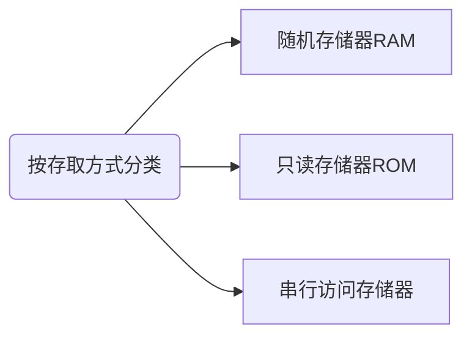
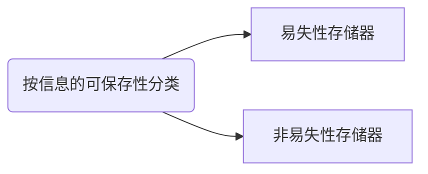
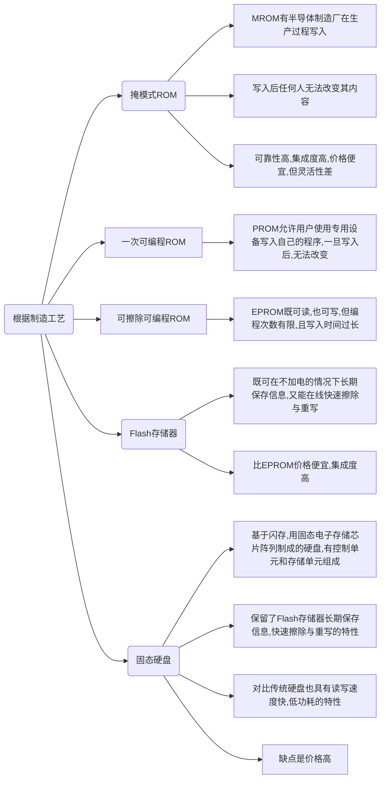

# 第1章 计算机系统概述

> #### 考纲内容：
>
> - 计算机系统层次结构
>   - 计算机系统的基本组成
>   - 计算机硬件的基本组成
>   - 计算机软件和硬件的关系
>   - 计算机系统的工作原理：“存储程序”方式、高级语言程序与机器语言程序的转换、程序和指令的执行过程
> - 计算机性能指标
>   - 吞吐量、响应时间、CPU时钟周期、主频、CPI、CPU执行时间
>   - MIPS、MFLOPS、GFLOPS、TFLOPS、PFLOPS、EFLOPS、ZFLOPS

## 1.1 计算机发展历程

### 1.1.1 计算机硬件的发展

#### 1. 计算机的四代变化

#### 2. 计算机元件的更新换代

- 摩尔定律
- 半导体存储器的发展
- 微处理器的发展

### 1.1.2 计算机软件的发展

## 1.2 计算机系统层次结构

### 1.2.1 计算机系统组成

硬件系统和软件系统共同构成了一个完整的计算机系统

### 1.2.2 计算机硬件

#### 1. 冯诺依曼机基本思想

- 采用“存储程序”的工作方式
- 计算机硬件系统由运算器、存储器、控制器、输入设备和输出设备5大部件组成
- 指令和数据以同等地位存储在存储器中，形式上没有区别，但计算机可以区分
- 指令和数据均用二进制代码表示。指令由操作码和地址码组成

> “存储程序”的基本思想是：将事先编制好的程序和原始数据送入主存后才能执行，一旦程序被启动执行，就无需人为干预，计算机会自动逐条执行指令，直至程序结束

#### 2. 计算机的功能部件

##### a> 输入设备

##### b> 输出设备

##### c> 存储器

- 主存储器（内存储器），CPU能够直接访问，工作方式是按存储单元的地址进行存取，基本组成如图所示：

  

  

- 辅助存储器（外存储器）

> 存储体存放二进制信息，地址寄存器（MAR）存放访存信息，经过地址译码后找到所选的存储单元。数据寄存器（MDR）用于暂存要从存储器中读或写的信息，时序控制逻辑用于产生存储器操作所需的各种时序信号
>
> MAR用于寻址，其位数对应着存储单元的个数，如MAR为10位，则有2^10^ = 1024个存储单元，记为1K。MAR长度与PC长度相等
>
> MDR的位数和存储字长相等，一般为字节的2次幂的整数倍
>
> MAR与MDR虽然是存储器的一部分，但在现代计算机中却是存在于CPU中的，另外，高速缓存（Cache）也是在CPU中

##### d> 运算器

运算器核心是算术逻辑单元（Arithmetic and Logical Unit，ALU）。运算器包含若干通用寄存器，用于暂存操作数和中间结果，如累加器（ACC）、乘商寄存器（MQ）、操作数寄存器（X）、变址寄存器（IX）、基址寄存器（BR）等，其中前三个寄存器是必须的

运算器内还有程序状态寄存器（PSW），也称标志寄存器，用于存放ALU运算得到的一些标志信息或处理机的状态信息，如结果是否溢出、有无进位或借位、结果是否为负等

##### e> 控制器

控制器由程序计数器（PC）、指令寄存器（IR）和控制单元（CU）组成。

一般将运算器和控制器集成到同一芯片上，称为中央处理器。CPU和主存储器共同构成主机，而除主机外的其他硬件装置统称为外部设备，简称外设

### 1.2.3 计算机软件

#### 1. 系统软件和应用软件

#### 2. 三个级别的语言

机器语言、汇编语言和高级语言

计算机无法之间理解和执行高级语言程序，需要将高级语言程序转换为机器语言程序，通常把进行这种转换的软件系统称为翻译程序：

- 汇编程序（汇编器）。将汇编语言程序翻译成机器语言
- 解释程序（解释器）。将源程序中的语句按执行顺序逐条翻译成机器指令并立即执行
- 编译程序（编译器）。将高级语言程序翻译成汇编语言或机器语言程序

#### 3. 软件和硬件的逻辑功能等价性

### 1.2.4 计算机系统的层次结构

层次之间的关系紧密，下层是上层的基础，上层是下层的扩展

软件和硬件之间的界面就是指令集体系结构（ISA），ISA定义了一台计算机可以执行的所有指令的集合，每条指令规定了计算机执行什么操作，以及所处理的的操作数存放的地址空间和操作数类型。

### 1.2.5 计算机系统的工作原理

#### 1. “存储程序”工作方式

#### 2. 从源程序到可执行文件

预处理阶段 -----> 编译阶段 -----> 汇编阶段 -----> 链接阶段

#### 3. 程序执行过程的描述

#### 4. 指令执行过程的描述

以取数指令为例，其信息流程如下：

1. 取指令：PC ---> MAR ---> M ---> MDR ---> IR
2. 分析指令：OP(IR) ---> CU
3. 执行指令：Ad(IR) ---> MAR ---> M ---> MDR ---> ACC

## 1.3 计算机的性能指标

### 1.3.1 计算机的主要性能指标

#### 1. 字长

指计算机进行一次整数运算所能处理的二进制数据的位数

#### 2. 数据通路带宽

数据总线一次所能并行传送信息的位数

> 各个子系统通过数据总线连接形成的数据传送路径称为数据通路

#### 3. 主存容量

主存储器所能存储信息的最大容量

#### 4. 运算速度

##### a> 吞吐量和响应时间

吞吐量指系统在单位时间内处理请求的数量，系统吞吐量主要取决于主存的存取周期

##### b> 主频和CPU时钟周期

CPU时钟周期，主频的倒数，是CPU中最小的时间单位

主频（CPU时钟频率），机器内部主时钟的频率

##### c> CPI（Cycle Per Instruction）

执行一条指令所需的时钟周期数

##### d> CPU执行时间

$$
CPU执行时间 = \frac {CPU时钟周期数} {主频} = \frac {指令条数 \times CPI} {主频}
$$

##### e> MIPS（Million Instructions Per Second），每秒执行多少百万条指令

$$
MIPS = \frac {指令条数}{执行时间 \times 10^6} = \frac {主频} {CPI \times 10^6}
$$

##### f> MFLOPS、GFLOPS、TFLOPS、PFLOPS、EFLOPS和ZFLOPS

#### 5. 基准程序

### 1.3.2 几个专业术语

#### 1. 系列机

具有基本相同的体系结构，使用相同基本指令系统的多个不同型号的计算机组成的一个产品系列

#### 2. 兼容

指软件和硬件的通用性

#### 3. 软件可移植性

指把使用在某个系列计算机中的软件直接或进行很少的修改就能运行在另一个系列计算机中的可能性

#### 4. 固件

将程序固化在ROM中组成的部件

# 第2章 数据的表示和运算

> #### 考纲内容：
>
> - 数制与编码
>   - 进位计数制及其相互转换，定点数的编码表示
> - 运算方法和运算电路
>   - 基本运算部件：加法器，算术逻辑单元（ALU）
>   - 加/减运算：补码加/减运算器，标志位的生成
>   - 乘/除运算：乘/除法运算的基本原理，乘法运算和除法电路的基本结构
> - 整数的表示和运算
>   - 无符号整数的表示和运算，带符号整数的表示和运算
> - 浮点数的表示和运算
>   - 浮点数的表示：IEEE754标准，浮点数的加/减运算

## 2.1 数制与编码

### 2.1.1 进位计数制及其相互转换

#### 1. 进位计数法

#### 2. 不同进制数之间的相互转换

> 在计算机中，小数和整数不一样，整数可以连续表示，但小数是离散的，所以并不是每个十进制小数都可以准确的用二进制表示
>
> 十进制转换为任意进制数采用除基取余法和乘基取整法

#### 3. 真值和机器数

真值是机器数所代表的实际值

### 2.1.2 BCD码

- 8421码。若相加之和大于等于10,则要加6修正，并向高位进位
- 余3码。在8421码的基础上加3
- 2421码。特点是大于或等于5的4位二进制数中最高位为1，小于5的最高位为0，如5 ---> 1011

### 2.1.3 定点数的编码表示

在现代计算机中，通常用定点补码整数表示整数，定点原码小数表示浮点数的尾数部分，移码表示浮点数的阶码部分

#### 1. 机器数的定点表示

- 定点小数
- 定点整数

#### 2. 原码、补码、反码、移码

- 原码表示法

  原码表示的优点是与真值的对应关系简单、直观，与真值的转换简单，并且用原码实现乘除运算比较简单。缺点是，0的表示不唯一，更重要的是原码加减运算比较复杂

- 补码表示法

- 反码表示法

  0的表示不唯一，表示范围比补码少一个最小负数。反码在计算机中很少使用，通常作为数码变换的中间表示形式

- 移码表示法

  移码常用来表示浮点数的阶码。它只能表示整数

  移码中零的表示唯一，一个真值的移码和补码仅差一个符号位（补码符号位取反就得到了移码）

  移码全0时，对应的真值最小值-2^n^，移码全1时，对应真值的最大值2^n^ - 1

  移码保持了数据原有的大小顺序，移码大真值就大

原码、补码、反码、移码：

1. 原码、补码、反码符号位相同，正数的机器码相同
2. 原码、反码的表示在数轴上对称，二者都存在+0和-0两个零
3. 补码、移码的表示在数轴上不对称，零的表示唯一，他们比原码、反码多表示一个数
4. 整数的补码、移码的符号位相反，数值位相同
5. 负数的反码、补码末位相差1
6. 原码很容易判断大小。而负数的反码、补码很难直接判断大小（对于负数，数值部分越大，绝对值越小，真值越大）

### 2.1.4 整数的表示

#### 1. 无符号整数的表示

#### 2. 带符号整数的表示

计算机中的带符号整数都用补码表示，相比其他三码具有以下优势：

1. 与原码和反码相比，0的补码表示唯一
2. 与原码和移码相比，补码运算规则比较简单，且符号位可以和数值位一起参加运算
3. 与原码和反码相比，补码比原码和反码多表示一个最小负数

## 2.2 运算方法和运算电路

### 2.2.1 基本运算部件

在计算机中，运算器由算术逻辑单元（Arithmetic Logic Unit，ALU）、移位器、状态寄存器和通用寄存器等组成。运算器的基本功能包括加减乘除四则运算，与、或、非、异或等逻辑运算，以及移位、求补等操作。ALU的核心部件就是加法器

#### 1. 一位全加器

全加器（FA）是最基本的加法单元

#### 2. 串行进位加法器

#### 3. 并行进位加法器

#### 4. 带标志加法器

#### 5. 算术逻辑单元（ALU）

### 2.2.2 定点数的移位运算

#### 1. 算术移位

#### 2. 逻辑移位

逻辑移位将操作数视为无符号数

移位规则：左移，丢高位，低位添0；右移，丢低位，高位添0

#### 3. 循环移位

### 2.2.3 定点数的加减运算

#### 1.  补码的加减法运算

- 按二进制运算规则运算，逢二进一
- 加法直接相加，减法则将被减数与减数的机器负数相加
- 符号为与数值位一起参与运算，加、减运算结果的符号位也在运算中直接得出
- 最终运算结果的高位丢弃，保留n + 1位，运算结果亦为补码

#### 2. 补码加减运算电路

#### 3. 溢出判别方法

仅当两个符号相同的数相加或两个符号相异的数相减才可能产生溢出，补码定点数加减运算溢出判断的方法有3种：

- 采用一位符号位

- 采用双符号位

  也称模4补码，运算结果的两个符号位相同，表示未溢出；不同表示溢出，此时最高位符号位代表真正的符号

- 采用一位符号位根据数据位的进位情况判断溢出 

#### 4. 原码的加减法运算

### 2.2.4 定点数的乘除运算

#### 1. 定点数的乘法运算

- 原码一位乘法。符号位与数值位分开求
- 无符号数乘法运算电路
- 补码一位乘法（Booth算法）
- 补码乘法运算电路

#### 2. 定点数的除法运算

- 符号扩展
- 原码除法运算（不恢复余数法）
- 补码除法运算（加减交替法）
- 除法运算电路

### 2.2.5 C语言中的整数类型及类型转换

#### 1. 有符号数和无符号数的转换

强制类型转换的结果保持位值不变，仅改变了解释这些位的方式

#### 2. 不同字长整数之间的转换

当大字长变量向小字长变量强制类型转换时，系统把多余的高位部分直接截断，低位直接赋值

短字长向长字长转换时，不仅要使相应的位值相等，还要对高位部分进行扩展。原数字是无符号整数，则进行零扩展，否则进行符号扩展

### 2.2.6 数据的存储和排列

#### 1. 数据的“大端方式”和“小端方式”存储

大端方式按从最高有效字节到最低有效字节的顺序存储数据

#### 2. 数据按“边界对齐”方式存储

边界对齐方式相对边界不对齐方式是一种空间换时间的思想

## 2.3 浮点数的表示与运算

### 2.3.1 浮点数的表示

#### 1. 浮点数的表示格式

阶码的值反映浮点数的小数点的实际位置

阶码的位数反映浮点数的表示范围

尾数的位数反映浮点数的精度

#### 2. 浮点数的表示范围

上溢趋于无穷，下溢趋于0，数据下溢时，浮点数值趋于零，计算机仅将其当作机器零处理

#### 3. 浮点数的规格化

指通过调整一个非规格化浮点数的尾数和阶码的大小，使非零的浮点数在尾数的最高数位上保证是一个有效值

#### 4. IEEE754标准

#### 5. 定点、浮点表示的区别

- 数值范围。若字长相同，则浮点表示法所能表示的数值范围远大于定点表示法
- 精度。对于字长相同的定点数和浮点数来说，浮点数虽然扩大了数的表示范围，但精度降低了
- 数的运算。浮点数包括阶码和尾数两部分，运算时不仅要做尾数的运算，还要做阶码的运算，而且运算结果要求规格化，所以浮点运算比定点运算复杂
- 溢出问题。定点运算中，超出数的表示范围则溢出；浮点运算超出数的表示范围不一定溢出，只有规格化后阶码超出所能表示的范围时，才发生溢出

### 2.3.2 浮点数的加减运算

浮点数运算的特点是阶码运算和尾数运算分开进行，浮点数加减运算分为以下几步：

#### 1. 对阶

对阶的目的是使两个操作数的小数点位置对齐，即使得两个数的阶码相等。为此，先求阶差，然后以小阶向大阶看齐的原则，将阶码小的尾数右移一位，阶加一，直到两个数的阶码相等为止。尾数右移时，舍弃掉有效位会产生误差，影响精度

#### 2. 尾数求和

将对阶后的尾数按定点数加减运算规则运算

#### 3. 规格化

运算后的尾数不一定是规格化的

- 左规一次相当于乘2，右规一次相当于除2
- 需要右规时，只需进行一次

#### 4. 舍入

在对阶和尾数右规时，可能会对尾数进行右移，为保证运算精度，一般将低位移出的两位保留下来，参与中间过程的运算，最后将运算结果进行舍入，还原成IEEE754格式

常见舍入方法有：

- 0舍1入法，类似四舍五入
- 恒置1法
- 截断法

#### 5. 溢出判断

#### 6. C语言中的浮点数类型

C语言中的float和double类型分别对应于IEEE754单精度浮点数和双精度浮点数。long double类型对应于扩展双精度浮点数

在C程序中等式的赋值和判断中会出现强制类型转换，以char --> int --> long --> double和float --> double最为常见，从前到后范围和精度都从小到大，转换过程没有损失

1. int --> float,虽然不会发生溢出，但float尾数连隐藏位共24位，当int型数第24～31位非零时，无法精确转换成24位浮点数的尾数，需进行舍入处理，影响精度
2. int或float转换为double时，因double有效位数更多，因此能保留精确值
3. double转换为float时，可能溢出，而且尾数有效位数变少，因此高精度数转换时会发生舍入
4. float或double转换为int时，因int没有小数部分，数据会向0方向截断，发生舍入。另外，可能溢出

# 第3章 存储系统

> - 存储器的分类
> - 层次化存储器的基本结构
> - 半导体随即存取存储器
>   - SRAM、DRAM、Flash存储器
> - 主存储器
>   - DRAM芯片和内存条、多模块存储器、主存和CPU之间的连接
> - 外部存储器
>   - 磁盘存储器、固态硬盘（SSD）
> - 高速缓冲存储器（Cache）
>   - Cache的基本原理，Cache和主存之间的映射方式
>   - Cache中主存块的替换算法，Cache写策略
> - 虚拟存储器
>   - 虚拟存储器的概念
>   - 页式虚拟存储器：基本原理、页表、地址转换、TLB（快表）
>   - 段式虚拟存储器的基本原理，段页式虚拟存储器的基本原理

## 3.1 存储器概述

### 3.1.1 存储器的分类

### 3.1.2 存储器的性能指标

- 存储容量
- 单位成本
- 存储速度

### 3.1.3 多级层次的存储系统

存储器层次结构的主要思想是上一层的存储器作为低一层存储器的高速缓存

> 主存和Cache之间的数据调动是由硬件自动完成的，而主存和辅存之间的数据调动则是由硬件和操作系统共同完成的

## 3.2 主存储器

主存储器由DRAM实现，靠处理器的那一层则由SRAM实现，它们都属于易失性存储器，只要电源被切断，原来保存的信息便会丢失。ROM属于非易失性存储器

### 3.2.1 SRAM芯片和DRAM芯片

#### 1. SRAM的工作原理

> 存储元：存放一个二进制位的物理器件，是存储器最基本的构件
>
> 地址码相同的多个存储元构成一个存储单元
>
> 若干存储单元的集合构成存储体

静态随机存储器（SRAM）的存储元使用双稳态触发器（六晶体MOS）来记忆信息，非破坏性读出

SRAM存取速度快，但集成度低，功耗较大，价格昂贵，一般用于高速缓冲存储器

#### 2. DRAM的工作原理

动态随机存储器（DRAM）是利用存储元电路中栅极电容上的电荷来存储信息，DRAM的基本存储元通常只使用一个晶体管，所以它比SRAM的密度要高很多

相对来说，DRAM具有容易集成、位价低、容量大和功耗低等优点，但速度相对慢

DRAM电容上的电荷一般只能维持1～2ms，因此即使不断电，信息也会自动消失。为此，每个一定时间必须刷新，通常取2ms，称为刷新周期。常用刷新方式有3中：

- 集中刷新。缺点是在“死区”不能访问存储器
- 分散刷新。优点是没有死区，但加长了系统的存取周期，降低来整机的速度
- 异步刷新

DRAM的刷新需要注意一下问题：

1. 刷新对CPU是透明的，即刷新不依赖与外部的访问
2. 动态RAM的刷新单位是行，由芯片内部自行生成行地址
3. 刷新操作类似于读操作，但又有所不同
4. 刷新时不需要选片，即整个存储器中的所有芯片同时被刷新

#### 3. DRAM芯片的读写周期

#### 4. SRAM和DRAM的比较

#### 5. 存储器芯片的内部结构

- 存储体
- 地址译码器
- I/O控制电路
- 片选控制信号
- 读/写控制信号

### 3.2.2 只读存储器（ROM）

#### 1. ROM特点

- 结构简单，所以位密度比可读写存储器的高
- 具有非易失性，所以可靠性高

#### 2. ROM类型

### 3.2.3 主存储器的基本组成

- 由一个个存储0或1的记忆单元（也称存储元件）构成的存储矩阵（也称存储体）是存储器的核心部分
- 记忆单元是具有两种稳态的能表示二进制0和1的物理器件
- 为了存取存储体中的信息，必须对存储单元编号（也称编址）
- 编址单位是指具有相同地址的那些存储元件构成的一个单位，可以按字节编址，也可以按字编址

### 3.2.4 多模块存储器

一种空间并行技术，利用多个结构完全相同的存储模块的并行工作来提高存储器的吞吐率。常用的有单体多字存储器和多体低位交叉存储器

#### 1. 单体多字存储器

指令和数据在主存内必须是连续存放的，一旦遇到转移指令，或操作数不能连续存放，这种方法的效果就不明显

#### 2. 多体并行存储器

每个模块都有相同的容量和存取速度，各模块都有独立的读写控制电路、地址寄存器和数据寄存器。它们既能并行工作，又能交叉工作

多体并行存储器分为高位交叉编址和低位交叉编址两种

##### a> 高位交叉编址（顺序方式）

高位地址表示体号，低位地址表示为体内地址

高位交叉方式下，总是把低位的体内地址送到由高位体号确定的模块内进行译码。访问一个连续主存块时，总是现在一个模块内访问，等到该模块访问完才转到下一个模块访问，CPU总是按顺序访问存储模块，各模块不能被并行访问，因而不能提高存储器的吞吐率

##### b> 低位交叉编址（交叉方式）

低位地址为体号，高位地址为体内地址

## 3.3 主存储器与CPU的连接

### 3.3.1 连接原理

- 主存储器通过数据总线、地址总线和控制总线与CPU连接
- 数据总线的位数与工作频率的乘积正比于数据传输率
- 地址总线的位数决定了可寻址的最大内存空间
- 控制总线（读/写）指出总线周期的类型和本次输入/输出操作完成的时刻

### 3.3.2 主存容量的扩展

#### 1. 位扩展法

将多个存储芯片的地址端、片选端和读写控制端相应并联，数据端分别引出

#### 2. 字扩展法

增加存储器中字的数量，而位数不变。字扩展将芯片的地址线、数据线、读写控制线相应并联，而由片选信号来区分个芯片的地址范围

#### 3. 字位同时扩展法

既能增加存储字的数量，又增加存储字长

### 3.3.3 存储芯片的地址分配和片选

CPU要实现对存储单元的访问，首先要选择存储芯片，即进行片选；然后为选中的芯片依地址码选择相应的存储单元，以进行数据的存取，即进行字选。片选信号的产生分为线选法和译码片选法：

#### 1. 线选法

用除片内寻址外的高位地址线直接分别接至各个存储芯片的片选端，当某地址线信息为“0”时，就选中与之对应的存储芯片

#### 2. 译码片选法

用除片内寻址外的高位地址线通过地址译码器芯片产生片选信号

### 3.3.4 存储器与CPU的连接

#### 1. 合理选择存储芯片

#### 2. 地址线的连接

#### 3. 数据线的连接

#### 4. 读/写命令线的连接

#### 5. 片选线的连接

## 3.4 外部存储器

### 3.4.1 磁盘存储器

优点：

- 存储容量大，位价格低
- 记录介质可重复使用
- 记录信息可长期保存而不丢失，甚至可脱机存档
- 非破坏性读出，读出时不需要再生

缺点：存取速度慢，机械结构复杂，对工作环境要求较高

#### 1. 磁盘存储器

##### a> 磁盘设备的组成

- 硬盘存储器由磁盘驱动器、磁盘控制器和盘片组成
  - 磁盘驱动器。核心部件是磁头组件和盘片组件，温彻斯特盘是一种可移动磁头固定盘片的硬盘存储器
  - 磁盘控制器。硬盘存储器和主机的接口，主流的标准有IDE、SCSI、SATA等
- 存储区域。一块硬盘含有若干记录面，每个记录面划分为若干磁道，而每条磁道又划分为若干扇区，扇区是磁盘读写的最小单位，即磁盘按块读取
  - 磁头数（Heads）：即记录面数，表示硬盘共有多少个磁头，磁头用于读取/写入盘片上记录面的信息，一个记录面对应一个磁头
  - 柱面数（Cylinders）：表示硬盘每面盘片上有多少条磁道。在一个盘组中，不同记录面的相同编号的诸磁道构成一个圆柱面
  - 扇区数（Sectors）：表示每条磁道上有多少个扇区

##### b> 磁记录原理

原理：磁头和磁性记录介质相对运动时，通过电磁转换完成读/写操作

编码方法：按某种方案，把一连串的二进制信息变换成存储介质磁层中一个磁化翻转状态的序列

磁记录方式：通常采用调频制（FM）和改进型调频制（MFM）的记录方式

##### c> 磁盘的性能指标

- 记录密度
- 磁盘的容量
- 平均存取时间
- 数据传输率

##### d> 磁盘地址

主机向磁盘控制器发送寻址信息，磁盘的地址一般如下图所示：

##### e> 硬盘的工作过程

硬盘的主要操作是寻址、读盘、写盘。每个操作都对应一个控制字，硬盘工作时，第一步是去控制字，第二步是执行控制字

硬盘属于机械式部件，其读写操作是串行的，不可能在同一时刻既读又写，也不可能在同一时刻读两组数据或写两组数据

#### 2. 磁盘阵列

RAID（独立冗余磁盘阵列）是指将多个独立的物理磁盘组成一个独立的逻辑盘，数据在多个物理盘上分割交叉存储、并行访问，具有更好的存储性能、可靠性和安全性

RAID的分级如下：

- RAID0：无冗余和无校验的磁盘阵列
- RAID1：镜像磁盘阵列
- RAID2：采用纠错的海明码的磁盘阵列
- RAID3：位交叉奇偶校验的磁盘阵列
- RAID4：块交叉奇偶校验的磁盘阵列
- RAID5：无独立校验的奇偶校验的磁盘阵列

RAID0没有容错能力，RAID1使两个磁盘同时进行读写，互为备份（容量减少一半）

RAID通过同时使用多个磁盘，提高了传输率；通过在多个磁盘上并行存取来大幅提高存储系统的数据吞吐量；通过镜像功能，提高安全可靠性；通过数据校验，提供容错能力

### 3.4.2 固态硬盘

- 由半导体存储器构成，没有移动的部件，因而随机访问时间比机械磁盘要快很多
- 没有任何机械噪声和震动，能耗更低，抗震性好，安全性高
  - 反复写之后，闪存块会磨损

## 3.5 高速缓冲存储器

### 3.5.1 程序访问的局部性原理

包括时间局部性和空间局部性

高速缓冲技术就是利用局部性原理，把程序中正在使用的部分数据存放在一个高速的、容量较小的Cache中，使CPU的访存操作大多数针对Cache进行，从而提高程序执行速度

### 3.5.2 Cache的基本工作原理

### 3.5.3 Cache和主存的映射方式

Cache行中的信息是主存中某个块的副本，地址映射是指把主存地址空间映射到Cache地址空间，即把存放在主存中的信息按照某种规则装入Cache，地址映射的方法有3中：

#### 1. 直接映射

主存中的每一块只能装入Cache中的唯一位置，若这个位置已有内容，则产生块冲突，原来的块将无条件被替换出去。这将导致有空地址也不能占用，空间利用率低。

直接映射关系可定义为:
$$
Cache行号 = 主存块号 \ mod \ Cache总行数
$$

#### 2. 全相联映射

主存中的每一块可以装入Cache中的任何位置，每行的标记用于指出该行取自主存的哪一块，比较灵活，Cache块的冲突概率低，空间利用率高，命中率也高。但标记的比较速度较慢，实现成本较高，通常需要采用昂贵的按内容寻址的相联存储器进行地址映射

#### 3. 组相联映射

将Cache分成Q个大小相等的组，每个主存块可以装入固定组中的任意一行，即组间采用直接映射，而组内采用全相联映射的方式

> 三种映射方式中，直接映射的每个主存块只能映射到Cache中的某一固定行；全相联映射可以映射到所有Cache行；N路组相联映射可以映射到N行。当Cache大小、主存块大小一定时：
>
> - 直接映射的命中率最低，全相联映射的命中率最高
> - 直接映射的判断开销最小、所需时间最短，全相联映射的判断开销最大、所需时间最长
> - 直接映射标记所占的额外空间开销最少，全相联映射标记所占的额外空间开销最大

### 3.5.4 Cache中主存块的替换算法

- 随机算法 RAND

- 先进先出算法 FIFO

- 近期最少使用算法 LRU

  LRU算法对每个Cache行设置一个计数器，用计数值来记录主存块的使用情况，并根据计数值选择淘汰某个块，计数器的变化规则：

  1. 命中时，所命中的行的计数器清零，比其低的计数器加1,其余不变
  2. 未命中且还有空闲行时，新装入的行的计数器置0,其余全加1
  3. 未命中且无空闲行时，计数值为3的行的信息块被淘汰，新装行的块的计数器置0,其余全加1

- 最不经常使用算法 LFU

  每行也设置一个计数器，新行建立后从0开始计数，每访问一次，被访问的行计数器加1,需要替换时比较各特定行的计数值，将计数值最小的行换出

### 3.5.5 Cache写策略

- 全写法（写直通法、write-through）。当CPU对Cache写命中时，必须把数据同时写入Cache和主存。增加了访存次数，降低了Cache的效率。为减少全写法直接写入主存的时间损耗，在Cache和主存之间加一个写缓冲（Write Buffer）
- 回写法（write-back）。只有当块被换出时才写回主存。减少了访存次数，但存在不一致的隐患。为减少写回主存的开销，每个Cache行设置一个修改位（脏位）。修改位为0,则说明对应Cache行中的块未被修改，替换时不需要写回主存

全写法和回写法都对应于Cache写命中时的情况，对于Cache写不命中，也有两种处理方法：

- 写分配法（write-allocate）。加载主存中的块到Cache中，然后更新这个Cache块。它试图利用程序的空间局部性，但缺点是每次不命中都需要从主存中读取一块
- 非写分配法（not-write-allocate）。只写入主存，不进行调块

> 非写分配法通常与全写法合用，写分配法通常和回写法合用

## 3.6 虚拟存储器

> 虚拟存储器具有主存的速度和辅存的容量

### 3.6.1 虚拟存储器的基本概念

虚拟存储器将主存或辅存的地址空间统一编址，形成一个庞大的地址空间。采用和Cache类似的技术，将辅存中经常访问的数据副本存放到主存中。虚拟存储机制采用全相联映射，处理一致性问题，采用回写法。

### 3.6.2 页式虚拟存储器

- 页面长度固定、页表简单，调入方便

- 由于程序不可能正好是页面的整数倍，最后一页的零头将无法利用而造成浪费。

- 页不是逻辑上独立的实体，在处理、保护和共享都不及段式虚拟存储器方便

#### 1. 页表

#### 2. 快表

#### 3. 具有TLB和Cache的多级存储系统

### 3.6.3 段式虚拟存储器

- 段的分界与程序的自然分界相对应，因而具有逻辑独立性，使得它易于编译、管理、修改和保护，也便于多道程序的共享
- 因为段长度可变，分配空间不便，容易在段间留下碎片，不好利用，造成浪费

### 3.6.4 段页式虚拟存储器

- 兼具页式和段式虚拟存储器的优点，可以按段实现共享和保护
- 地址变换过程中需要两次查表，系统开销较大

### 3.6.5 虚拟存储器和Cache的比较

#### 相同之处

1. 最终目标都是为了提高系统性能，两者都有容量、速度、价格的梯度
2. 都把数据划分为小信息块，并作为基本的传递单位，虚存系统的信息块更大
3. 都有地址的映射、替换算法、更新策略等问题
4. 依据程序的局部性原理应用“快速缓存思想”，将活跃的数据放在相对高速的部件中

#### 不同之处

1. Cache主要解决系统速度，而虚拟存储器却是为了解决主存容量
2. Cache全由硬件实现，对所有程序员透明；而虚拟存储器由OS和硬件共同实现，对系统程序员不透明，但对应用程序员透明

3. 对于不命中性能影响，因为CPU的速度约为Cache的10倍，主存的速度为硬盘的100倍以上，因此虚拟存储器系统不命中是对系统性能影响更大
4. CPU与Cache和主存都建立了直接访问的通路，而辅存与CPU没有直接通路。也就是说，在Cache不命中时主存能和CPU直接通信，同时将数据调入Cache；而虚拟存储器系统不命中时，只能先由硬盘调入主存，而不能直接和CPU通信

# 第4章 指令系统

> - 指令格式的基本概念
> - 指令格式
> - 寻址方式
> - 数据的对齐和大/小端存放方式
> - CISC和RISC的基本概念
> - 高级语言程序与机器级代码之间的对应
>   - 编译器、汇编器与链接器的基本概念；选择结构语句的机器级表示
>   - 循环结构语句的机器级表示；过程（函数）调用对应的机器级表示

## 4.1 指令系统

一台计算机的所有指令的集合构成该机的指令系统，也称指令集。指令系统是指令集体系结构（ISA）中最核心的部分，ISA完整定义了软件和硬件之间的接口，其规定的内容主要包括：指令格式，数据类型及格式，操作数的存放方式，程序可访问的寄存器个数、位数和编号，存储空间的大小和编址方式，寻址方式，指令执行过程的控制方式等

### 4.1.1 指令的基本格式

一条指令通常包括操作码字段和地址码字段。

- 定长指令字结构。定字长指令的执行速度快，控制简单
- 变长指令字结构

因为主存一般是按字节编址的，所以指令字长多为字节的整数倍，根据指令中操作数地址码的数目的不同，可将指令分为以下几种格式：

#### a> 零地址指令

只给出操作码OP，没有显式地址，有两种可能：

1. 不需要操作数的指令，如空操作指令、停机指令、关中断指令等
2. 零地址的运算类指令仅用在堆栈计算机中。通常参与运算的两个操作数隐含的从栈顶和次栈顶弹出

#### b> 一地址指令

1. 只有目的操作数的单操作数指令，如操作码含义是加1、减1、求反、求补等
2. 隐含约定目的地址的双操作数指令

#### c> 二地址指令

#### d> 三地址指令

#### e> 四地址指令

### 4.1.2 定长操作码指令格式

在指令字的最高位部分分配固定的若干位表示操作码

### 4.1.3 扩展操作码指令格式

设计扩展操作码指令格式时，须注意：

- 不允许短码是长码的前缀，即短操作码不能与长操作码的前面部分的代码相同
- 各指令的操作码一定不能重复

### 4.1.4 指令的操作类型

按功能可分为：

#### a> 数据传送

寄存器间（MOV）、内存单元读取数据到CPU寄存器（LOAD）、CPU寄存器写数据到内存单元（STORE）

#### b> 算术和逻辑运算

加ADD、减SUB、比较CMP、乘MUL、除DIV、加1 INC、减1 DEC、与AND、或OR、取反NOT、异或XOR

#### c> 移位操作

算术移位、逻辑移位、循环移位

#### d> 转移操作

无条件转移JMP、条件转移BRANCH、调用CALL、返回RET、陷阱TRAP

> 调用指令和转移指令的区别：执行调用指令时必须保存下一条指令的地址，当子程序执行结束时，根据返回地址返回到主程序继续执行；而转移指令则不返回执行

#### e> 输入输出操作

这类指令用于完成CPU与外部设备交换数据或传送控制命令及状态信息

## 4.2 指令的寻址方式

### 4.2.1 指令寻址和数据寻址

寻址下一条将要执行的指令地址称为指令寻址；寻找本条指令的数据地址称为数据寻址

#### 1. 指令寻址

##### a> 顺序寻址方式

通过PC加1,自动形成下一条指令的地址

##### b> 跳跃寻址

通过转移类指令实现

#### 2. 数据寻址

### 4.2.2 常见的数据寻址方式

#### 1. 隐含寻址

有利于缩短指令字长，但需要增加存储操作数或隐含地址的硬件

#### 2. 立即（数）寻址

地址字段指出的不是操作数的地址，而是操作数本身，又称立即数，采用补码表示

优点是指令在执行阶段不访问主存，指令执行时间最短；缺点是A的位数限制了立即数的范围

#### 3. 直接寻址

简单，指令在执行阶段仅访问一次主存，不需要专门计算操作数的地址；缺点是A的位数决定了该指令操作数的寻址范围，操作数的地址不易修改

#### 4. 间接寻址

优点是可扩大寻址范围，便于编制程序；缺点是指令在执行期间要多次访存。由于访问速度过慢，这种寻址方式并不常用。一般问到扩大寻址范围时，通常指的是寄存器间接寻址

#### 5. 寄存器寻址

优点是指令在执行阶段不访问主存，只访问寄存器，执行速度快；缺点是寄存器价格昂贵，计算机中个数有限

#### 6. 寄存器间接寻址

与一般间接寻址相比速度更快，但指令的执行阶段需要访问主存

#### 7. 相对寻址

优点是操作数的地址不是固定的，因此便于程序浮动。相对寻址广泛应用于转移指令

#### 8. 基址寻址

优点是可扩大寻址范围；用户不必考虑自己的程序存于主存的哪个空间区域，因此有利于多道程序设计。但偏移量的位数较短

#### 9. 变址寻址

优点是可扩大寻址范围，特别适合编制循环程序

#### 10. 堆栈寻址

## 4.3 程序的机器级代码表示

### 4.3.1 常用汇编指令介绍

#### 1. 相关寄存器

x86处理器中有8个32位的通用寄存器。为了向后兼容，EAX、EBX、ECX、EDX的高两位字节和低两位字节可以独立使用，E为Extended，表示32位寄存器。

> 除了EBP和ESP外，其他几个寄存器的用途是比较任意的

#### 2. 汇编指令格式

一般有两种不同的汇编格式：AT&T格式和Intel格式。它们主要区别如下：

- AT&T格式的指令只能用小写字母，而Intel格式的指令对大小写不敏感
- 在AT&T格式中，第一个为源操作数，第二个为目的操作数，方向从左到右，合乎自然。而Intel反之
- 在AT&T格式中，寄存器需要加前缀“%”，立即数需要加前缀“$”；Intel格式中，都不需要
- 在内存寻址方面，AT&T格式使用“(”和“)”，而Intel使用“[”和“]”
- 在处理复杂寻址方式时，例如AT&T格式的内存操作数“disp(base, index, scale)”分别表示偏移量、基址寄存器、变址寄存器和比例因子
- 在指定数据长度方面，AT&T格式指令操作码后面紧跟一个字符，表示操作数大小，“b”表示byte，“w”表示word，“l”表示long（双字）。Intel格式也有类似的语法，它在操作码后面显式地注明byte ptr、word ptr或dword ptr

> 由于32或64位体系结构都是由16位扩展而来，因此用word来表示16位

#### 3. 常用指令

##### a> 数据传送指令

###### 1. mov指令

###### 2. push指令

###### 3. pop指令

##### b> 算术和逻辑运算指令

###### 1. add/sub指令

###### 2. inc/dec指令

###### 3. imul指令

###### 4. idiv指令

###### 5. add/or/xor指令

###### 6. not指令

###### 7. neg指令

###### 8. shl/shr指令

##### c> 控制流指令

###### 1. jmp指令

###### 2. jcondition指令

###### 3. cmp/test指令

###### 4. call/ret指令

### 4.3.2 过程调用的机器级表示

call/ret指令主要用于过程调用，属于一种无条件转移指令。假设过程P（调用者）调用过程Q,过程调用的执行步骤如下：

1. P将入口参数（实参）放在Q能访问到的地方
2. P将返回地址存到特定的地方，然后将控制转移到Q
3. Q保存P的现场（通用寄存器的内容），并为自己的非静态局部变量分配空间
4. 执行过程Q
5. Q恢复P的现场，将返回结果放到P能访问到的地方，并释放局部变量所占空间
6. Q取出返回地址，将控制转移到P

### 4.3.3 选择语句的机器级表示

编译器通过条件码（标志位）设置指令和各类转移指令来实现程序中的选择结构语句

- CF：进（借）位标志
- ZF：零标志
- SF：符号标志
- OF：溢出标志

### 4.3.4 循环语句的机器级标志

## 4.4 CISC和RISC的基本概念

指令系统朝着两个截然不同的方向发展：

1. 增强原有指令功能，设置更为复杂的新指令实现软件功能的硬化，这类机器称为复杂指令系统计算机（CISC）
2. 减少指令种类和简化指令功能，提高指令的执行速度，这类机器称为精简指令系统计算机（RISC）

### 4.4.1 CISC

主要特点如下：

- 指令系统复杂庞大， 指令数目一般为200条以上
- 指令长度不固定，指令格式多，寻址方式多
- 可以访存的指令不受限制
- 各种指令使用频度相差很大
- 各种指令执行时间相差很大，大多数指令需多个时钟周期才能完成
- 控制器大多数采用微程序控制。有些指令非常复杂，以至于无法采用硬连线控制
- 难以用优化编译生成高效的目标代码程序

### 4.4.2 RISC

中心思想：指令系统简化，尽量使用寄存器-寄存器操作指令，指令格式力求一致，主要特点：

- 选取使用频率最高的一些简单指令，复杂指令的功能由简单指令的组合来实现
- 指令长度固定，指令格式种类少，寻址方式种类少
- 只有Load/Store（取数/存数）指令访存，其余指令的操作都在寄存器之间进行
- CPU中通用寄存器的数量相当多
- RISC一定采用指令流水线技术，大部分指令在一个时钟周期内完成
- 以硬布线控制为主，不用或少用微程序控制
- 特别重视编译优化工作，以减少程序执行时间

### 4.4.3 CISC和RISC的比较

|                  | CISC                                 | RISC                                 |
| ---------------- | ------------------------------------ | ------------------------------------ |
| 指令系统         | 复杂，庞大                           | 简单，精简                           |
| 指令数目         | 一般大于200条                        | 一般小于100条                        |
| 指令字长         | 不固定                               | 定长                                 |
| 可访存指令       | 不加限制                             | 只有Load/Store指令                   |
| 各种指令执行时间 | 相差较大                             | 绝大多数在一个周期内完成             |
| 各种指令使用频度 | 相差很大                             | 都比较常用                           |
| 通用寄存器数量   | 较少                                 | 多                                   |
| 目标代码         | 难以用优化编译生成高效的目标代码程序 | 采用优化的编译程序，生成代码较为高效 |
| 控制方式         | 绝大多数为微程序控制                 | 绝大多数为组合逻辑控制               |
| 指令流水线       | 可以通过一定方式实现                 | 必须实现                             |

# 第5章 中央处理器

> - CPU的功能和基本结构
> - 指令执行过程
> - 数据通路的功能和基本结构
> - 控制器的功能和工作原理
> - 异常和中断机制
>   - 异常和中断的基本概念，分类，检测与响应
> - 指令流水线
>   - 指令流水线的基本概念和基本实现
>   - 结构冒险、数据冒险和控制冒险的处理，超标量和动态流水线的基本概念
> - 多处理器基本概念
>   - SISD、SIM、MIMD、向量处理器的基本概念，硬件多线程的基本概念
>   - 多核（multi-core）处理器的基本概念，共享内存多处理器（SMP）的基本概念

## 5.1 CPU的功能和基本结构

### 5.1.1 CPU的功能

中央处理器由运算器和控制器组成。其中：

- 控制器负责协调并控制计算机各部件执行程序的指令序列，包括取指令、分析指令和执行指令
- 运算器负责对数据进行加工

CPU的具体功能包括：

- 指令控制
- 操作控制
- 时间控制
- 数据加工
- 中断处理

### 5.1.2 CPU的基本结构

#### 1. 运算器

是计算器对数据进行加工处理的中心：

- 算术逻辑单元。进算术/逻辑运算
- 暂存寄存器。用于暂存从主存读来的数据，该数据不能存放在通用寄存器中，否则会破坏其原有内容。对应用程序员透明
- 累加寄存器
- 通用寄存器组
- 程序状态字寄存器。保留由算术逻辑运算指令或测试指令的结果而建立的各种状态信息。PSW中的这些位参与并决定微操作的形成
- 移位器。对操作数或运算结果进行移位运算
- 计数器。控制乘除运算的操作步数

#### 2. 控制器

控制器有硬布线控制器和微程序控制器两种：

- 程序计数器。用于指出欲执行指令在主存中的存放地址
- 指令寄存器
- 指令译码器
- 存储器地址寄存器
- 存储器数据寄存器
- 时序系统
- 微操作信号发生器

## 5.2 指令执行过程

### 5.2.1 指令周期

指CPU从主存中取出并执行一条指令的时间

> 中断周期中的进栈操作是将SP减1,这和传统意义上的进栈操作相反，原因是计算机中的堆栈中都是向低地址增加

### 5.2.2 指令周期的数据流

数据流是根据指令要求依次访问的数据序列

#### 1. 取指周期

#### 2. 间址周期

取操作数有效地址

#### 3. 执行周期

#### 4. 中断周期

### 5.2.3 指令执行方案

#### 1. 单指令周期

对所有指令都选用相同的执行时间来完成

#### 2. 多指令周期

#### 3. 流水线方案

指令之间可以并行执行的方案

## 5.3 数据通路的功能和基本结构

### 5.3.1 数据通路的功能

数据在功能部件之间传送的路径称为数据通路，包括数据通路上流经的部件。它描述了信息从什么地方开始，中间经过哪个寄存器或多路开关，最后传送到哪个寄存器，这些都需要加以控制

数据通路的功能是实现CPU内部的运算器与寄存器及寄存器之间的数据交换

### 5.3.2 数据通路的基本结构

##### a> CPU内部单总线方式

##### b> CPU内部多总线方式

##### c> 专用数据通路方式

#### 1. 寄存器之间的数据传送

可通过CPU内部总线完成

#### 2. 主存与CPU之间的数据传送

也要借助CPU内部总线完成

#### 3. 执行算术或逻辑运算

## 5.4 控制器的功能和工作原理

### 5.4.1 控制器的结构和功能

控制器是计算机系统的指挥中心，主要功能有：

1. 从主存中取出一条指令，并指出下一条指令在主存中的位置
2. 对指令进行译码或测试，产生相应的操作控制信号，以便启动规定的动作
3. 指挥并控制CPU、主存、输入和输出设备之间的数据流动方向

### 5.4.2 硬布线控制器

基本原理是根据指令的要求、当前的时序及外部和内部的状态，按时间的顺序发送一系列微操作控制信号。它由复杂的组合逻辑门电路和一些触发器构成，因此又称组合逻辑控制器

#### 1. 硬布线控制单元图

#### 2. 硬布线控制器的时序系统及微操作

#### 3. CPU的控制方式 

- 同步控制方式
- 异步控制方式
- 联合控制方式

#### 4. 硬布线控制单元设计步骤

1. 列出微操作命令的操作时间表
2. 进行微操作信号综合
3. 画出微操作命令的逻辑图

### 5.4.3 微程序控制器

采用存储逻辑实现，也就是把微操作信号代码化，使每条机器指令转化成为一段微程序并存入一个专门的存储器中，微操作控制信号由微指令产生

#### 1. 微程序控制的基本概念

- 微命令与微操作。将控制部件向执行部件发出的各种控制命令称为微命令，是构成控制序列的最小单位。微命令是微操作的控制信号，微操作是微命令的执行过程

- 微指令与微周期。微指令是若干微命令的集合。存放微指令的控制存储器的单元地址称为微地址。一条微指令通常至少包含两大部分信息：

  - 操作控制字段，用于产生某一步操作所需的各种操作控制信号
  - 顺序控制字段，用于控制产生下一条要执行的微指令地址

  微周期是指执行一条微指令所需的时间，通常为一个时钟周期

- 主存储器与控制存储器
- 程序与微程序

> 1. 地址寄存器MAR。用于存放主存的读/写地址
> 2. 微地址寄存器CMAR。用于存放控制存储器的读/写微指令的地址
> 3. 指令寄存器IR。用于存放从主存中读出的指令
> 4. 微指令寄存器CMDR。用于存放从控制存储器读出的微指令

#### 2. 微程序控制器组成和工作过程

##### a> 微程序控制器的基本组成

- 控制存储器。微程序控制器的核心部件，存放各指令对应的程序，可用只读存储器ROM构成
- 微指令寄存器。存放从CM中取出的微指令，它的位数同微指令字长相等
- 微地址形成部件。产生初始微地址和后继微地址，以保证微指令的连续执行
- 微地址寄存器。接受微地址形成部件送来的微地址，为在CM中读取微指令做准备

##### b> 微程序控制器的工作过程

1. 执行取微指令公共操作
2. 由机器指令的操作码字段通过微地址形成部件产生该机器指令所对应的微程序的入口地址，并送入CMAR
3. 从CM中逐条取出对应的微指令并执行
4. 执行完对应于一条机器指令的一个微程序后，又回到取指微程序的入口地址，继续第一步，以完成取下一条机器指令的公共操作

##### c> 微程序和机器指令

通常，一条机器指令对应一个微程序

#### 3. 微指令的编码方式

指如何对微指令的控制字段进行编码，以形成控制信号。编码的目标是在保证速度的情况下，进来缩短微指令字长

- 直接编码（直接控制）方式
- 字段直接编码方式
- 字段间接编码方式

#### 4. 微指令的地址形成方式

- 直接由微指令的下地址字段指出
- 根据机器指令的操作码形成
- 增量计数器法
- 根据各种标志决定微指令分支转移的地址
- 通过测试网络形成
- 由硬件直接产生微程序入口地址

#### 5. 微指令的格式

- 水平型微指令。微程序短，执行速度快但微指令长，编写微程序麻烦
- 垂直型微指令。微指令短、简单、规整，便于编写微程序，但微程序长，执行速度慢，工作效率低
- 混合型微指令。在垂直型的基础上增加一些不太复杂的并行操作

#### 6. 微程序控制单元的设计步骤

1. 写出对应机器指令的微操作命令及节拍安排
2. 确定微指令格式
3. 编写微指令码点

#### 7. 动态微程序设计和毫微程序设计

- 动态微程序设计需要科协控制寄存器的支持，否则难以改变微程序的内容。实现可采用可擦除可编程只读存储器（EPROM）
- 毫微程序设计。若硬件不由微程序直接控制，而是通过存放在第二级控制存储器中的毫微程序来解释的，这个第二级控制存储器就称为毫微存储器，直接控制硬件的是毫微微指令

#### 8. 硬布线和微程序控制器的特点

|          | 微程序控制器                                                 | 硬布线控制器                                                 |
| -------- | ------------------------------------------------------------ | ------------------------------------------------------------ |
| 工作原理 | 微操作控制信号以微程序的形式存放在控制存储器中，执行指令时读出即可 | 微操作控制信号由组合逻辑电路根据当前的指令码、状态和时序，即时产生 |
| 执行速度 | 慢                                                           | 快                                                           |
| 规整性   | 较规整                                                       | 繁琐、不规整                                                 |
| 应用场合 | CISC CPU                                                     | RISC CPU                                                     |
| 易扩充性 | 易扩充修改                                                   | 困难                                                         |

## 5.5 异常和中断机制

### 5.5.1 异常和中断的基本概念

由CPU内部产生的意外事件被称为异常，也称内中断。异常是CPU执行一条指令时，由CPU在其内部检测到的、与正在执行的指令相关的同步事件

向CPU发出的中断请求被称为中断，通常用于信息的输入和输出，也称外中断。中断是一种典型的由外部设备触发的、与当前正在执行的指令无关的异步事件

### 5.5.2 异常和中断的分类

#### 1. 异常的分类

按异常发生原因和返回方式的不同：

- 故障
- 自陷
- 终止

#### 2. 中断的分类

- 可屏蔽中断
- 不可屏蔽中断

### 5.5.3 异常和中断响应过程

1. 关中断
2. 保存断点和程序状态
3. 识别异常和中断并转到相应的处理程序

## 5.6 指令流水线

### 5.6.1 指令流水线的基本概念

可从两方面提高处理机的并行性：

1. 时间上的并行技术——流水线技术
2. 空间上的并行技术——超标量处理机

#### 1. 指令流水的定义

流水线设计的原则是，指令流水段个数以最复杂指令所用的功能段个数为准，流水段的的长度以最复杂的操作所花的时间为准。为实现指令流水线，指令集应具有如下特征：

- 指令长度应尽量一致
- 指令格式应尽量规整
- 采用Load/Store指令
- 数据和指令在存储器中“对齐”存放

#### 2. 流水线的表示方法

通常用时空图来直观的描述流水线的执行情况

### 5.6.2 流水线的基本实现

#### 1. 流水线的数据通路

#### 2. 流水线的控制信号

#### 3. 流水线的执行过程

### 5.6.3 流水线的冒险与处理

#### 1. 结构冒险

多条指令在同一时刻争用同一资源而形成的冲突：

- 前一指令访存时，后一条相关指令暂停一个时钟周期
- 单独设置数据存储器和指令存储器，使取数和取指令操作各自在不同存储器中进行

#### 2. 数据冒险

在一个程序中，下一条指令会用到当前指令计算出的结果，此时这两条指令发生数据冲突，数据冒险可分为三类：

- 写后读
- 读后写
- 写后写

解决办法有：

- 把遇到数据相关的指令及其后续指令都暂停一至几个时钟周期
- 设置相关专用通路
- 通过编译器对数据相关的指令编译优化

#### 3. 控制冒险

改变指令执行顺序的情况，解决办法有：

- 对转移指令进行分支预测，尽早生成转移目标地址
- 预取转移成功和不成功两个控制流方向上的目标指令
- 加快和提前形成条件码
- 提高转移方向的猜准率

### 5.6.4 流水线的性能指标

#### 1. 流水线的吞吐率

#### 2. 流水线的加速比

### 5.6.5 高级流水线技术

#### 1. 超标量流水线技术

#### 2. 超长指令字技术

#### 3. 超流水线技术

## 5.7 多处理器的基本概念

### 5.7.1 SISD、SIMD、MIMD的基本概念

#### 1. 单指令流单数据流（SISD）结构

#### 2. 单指令流多数据流（SIMD）结构

#### 3. 多指令流单数据流（MIMD）结构

不存在这样的计算机

#### 4. 多指令流多数据流（MIMD）结构

### 5.7.2 硬件多线程的基本概念

#### 1. 细粒度多线程

多个线程之间轮流交叉执行指令，多个线程之间的指令是不相干的，可以乱序并行执行

#### 2. 粗粒度多线程

仅在一个线程出现了较大开销的阻塞时，才切换线程

#### 3. 同时多线程

在实现指令级并行的同时，实现线程级并行

### 5.7.3 多核处理器的基本概念

### 5.7.4 共享内存多处理器的基本概念

具有共享的单一物理地址空间的多处理器称为共享内存多处理器（SMP）。单一地址空间的多处理器有两种类型：

- 统一存储访问（UMA）多处理器。每个处理器对所有存储单元的访问时间是大致相同的，即访问时间与哪个处理器提出访存请求及访问哪个字无关

  根据处理器与共享存储器之间的连接方式，分为基于总线、基于交叉开关网络和基于多级交换网络连接等几种处理器

- 非统一存储访问（NUMA）多处理器。

  处理器中不带高速缓存时，被称为NC-NUMA,处理器中带有一致性高速缓存时，被称为CC-NUMA

# 第6章 总线

> - 总线的基本概念
> - 总线的组成及性能指标
> - 总线事务和定时

## 6.1 总线概述

### 6.1.1 总线基本概念

#### 1. 总线的定义

一组能为多个部件分时共享的公共信息传送线路。分时和共享是总线的两个特点。

分时是指同一时刻只允许有一个部件向总线发送信息

共享是指总线上可以挂接多个部件

#### 2. 总线设备

主设备：获得总线控制权的设备

从设备：被主设备访问的设备，它只能响应从主设备发来的各种总线命令

#### 3. 总线特性

是指机械特性（尺寸、形状）、电气特性（传输方向和有效的电平范围）、功能特性和时间特性

### 6.1.2 总线的分类

按功能分为：

#### 1. 片内总线

芯片内部的总线，它是CPU芯片内部寄存器与寄存器之间、寄存器与ALU之间的公共连接线

#### 2. 系统总线

按传输信息内容不同，可分为：

- 数据总线
- 地址总线
- 控制总线

#### 3. I/O总线

#### 4. 通信总线

> 按时序控制方式可将总线划分为同步总线和异步总线，还可按数据传输格式将总线划分为并行总线和串行总线

### 6.1.3 系统总线的结构

#### 1. 单总线结构

- 结构简单，成本低，易于接入新的设备

- 带宽低、负载重，多个部件只能争用唯一的总线，且不支持并发传送操作

> 单总线并不是只有一根信号线，系统总线按传送信息的不同可细分为地址总线、数据总线和控制总线

#### 2. 双总线结构

- 一条主存总线，用于在CPU、主存和通道之间传送数据；另一条是I/O总线，用于在多个外部设备与通道之间传送数据

- 将低速I/O设备从单总线上分离出来，实现了存储器总线和I/O总线分离
- 需要增加通道等硬件设备

#### 3. 三总线结构

- 在计算机系统各部件之间采用3条各自独立的总线来构成信息通路，这三条总线分别是主存总线、I/O总线和直接内存访问（DMA）总线

- 提高了I/O设备的性能，使其更快的响应命令，提高系统吞吐量
- 系统工作效率较低

### 6.1.4 常见的总线标准

ISA、EISA、VESA、PCI、AGP、PCI-Express、USB

主要区别是总线宽度、带宽、时钟频率、寻址能力、是否支持突发传送等

### 6.1.5 总线的性能指标

- 总线传输周期
- 总线时钟周期
- 总线工作频率
- 总线时钟频率
- 总线宽度
- 总线带宽
- 总线复用
- 信号线数

## 6.2 总线事务和定时

是指总线在双方交换数据的过程中需要时间上配合关系的控制，其实质是一种协议或规则，主要有同步和异步两种基本定时方式

### 6.2.1 总线事务

从请求总线到完成总线使用的操作序列称为总线事务，它是在一个总线周期中发生的一系列活动。典型的总线事务包括：

- 请求阶段。主设备发出总线传输请求，并且获得总线控制权
- 仲裁阶段。总线仲裁机构决定将下一个传输周期的总线使用权授予某个申请者
- 寻址阶段。
- 传输阶段。
- 释放阶段。

### 6.2.2 同步定时方式

- 传送速度快，具有较高的传输速率，总线控制逻辑简单
- 主从设备属于强制性同步，不能及时进行数据通信的有效性检验，可靠性较差

适用于总线长度较短及总线所接部件的存取时间比较接近的系统

### 6.2.3 异步定时方式

- 总线周期长度可变，能保证两个工作速度相差很大的部件或设备之间可靠的进行信息交换，自动适应时间的配合
- 比同步控制方式稍复杂一些，速度比同步定时方式慢

根据“请求”和“回答”信号的撤销是否互锁，又分为以下：

1. 不互锁方式
2. 半互锁方式
3. 全互锁方式